# IT Infrastructure Simulation Project

Welcome to my enterprise IT and security Simulation! This project is a documentation of my journey building a corporate IT environment from scratch. Designed to simulate real-world infrastructure, this lab serves as a dedicated space for practicing system administration, security engineering, and network deployment.


## Table of Contents

* [Project Overview](#project-overview)
* [Lab Specifications & Infrastructure](#lab-specifications--infrastructure)
* [Naming Convention](#naming-convention)
* [Phase 1: Laying the Foundation (Hyper-V Setup)](#phase-1-laying-the-foundation-hyper-v-setup)
    * [1.1 Unlocking Hyper-V](#11-unlocking-hyper-v)
    * [1.2 Creating the Virtual Network (NAT)](#12-creating-the-virtual-network-nat)
* [Phase 2: Virtual Machine Provisioning](#phase-2-virtual-machine-provisioning)
    * [2.1 Provisioning the Domain Controller (DC01)](#21-provisioning-the-domain-controller-dc01)
* [Phase 4: Active Directory Domain Services (AD DS)](#phase-4-active-directory-domain-services-ad-ds)
    * [4.1 Forest Promotion & Domain Creation](#41-forest-promotion--domain-creation)
    * [4.2 Domain Controller Options](#42-domain-controller-options)
* [Phase 5: Domain Infrastructure & Client Integration](#phase-5-domain-infrastructure--client-integration)
    * [5.1 Organizational Unit (OU) Architecture](#51-organizational-unit-ou-architecture)
    * [5.2 Network Configuration for Endpoints](#52-network-configuration-for-endpoints)
    * [5.3 Joining the Domain](#53-joining-the-domain)
* [Phase 6: User & Group Management](#phase-6-user--group-management)
    * [6.1 User Account Provisioning](#61-user-account-provisioning)
    * [6.2 Directory Population & Verification](#62-directory-population--verification)
* [Progress Tracker & Next Steps](#progress-tracker--next-steps)

---

## Project Overview

The goal of this simulation is to bridge the gap between theory and practice by deploying a **fully functional Active Directory environment**, configuring network security policies, and managing endpoints just like a modern enterprise. This project serves as a comprehensive documentation of my progress in learning IT infrastructure and administration.

---

## Lab Specifications & Infrastructure

The environment consists of a hybrid architecture including Windows Server 2022 and Linux Debian distributions to simulate a real-world corporate network.

| Component | Operating System | Primary Role |
| :--- | :--- | :--- |
| **Server 01** | Windows Server 2022 | **Domain Controller (DC):** Responsible for managing Active Directory (AD) and handling authentication/authorization within the domain. |
| **Server 02** | Windows Server 2022 | **Utility Server:** Used for file storage, applications, or additional services required within the network. |
| **Server 03** | Linux (Debian 12.5) | **Monitoring Node:** Implemented to monitor the network and all devices within it. |
| **Workstations**| Windows Clients   | **Client Machines:** Four workstations joined to the domain to simulate end-user environments. |

---

## Naming Convention

To maintain organizational standards and ensure asset traceability, all client machines follow a strict naming convention.

* **Prefix:** `CHOIYONTECH` 
* **Client Identifier:** `PC`
* **Unique Sequence:** `01`, `02`, `03`, `04`

**Detailed Asset List:**
* `CHOIYONTECH-PC01`
* `CHOIYONTECH-PC02`
* `CHOIYONTECH-PC03`
* `CHOIYONTECH-PC04` 

---

---

## Phase 1: Laying the Foundation (Hyper-V Setup)

Before building the virtual domain, I needed a hypervisor to host it. I opted for Microsoft's native **Hyper-V** to manage the virtualization layer.

### 1.1 Unlocking Hyper-V
To get started, the built-in virtualization capabilities on the host machine needed to be awakened:
1. Navigated to **Control Panel > Programs > Programs and Features**.
2. Clicked on **Turn Windows features on or off**.
3. Checked the box for **Hyper-V**, hit OK, and rebooted the host machine to apply changes.


### 1.2 Creating the Virtual Network (NAT)
To allow the lab environment to communicate internally while sharing the host’s internet connection, I configured a **NAT (Network Address Translation)** virtual switch via PowerShell.

1. **Initialize the Internal Switch:**
   Using an elevated PowerShell session, I created a new internal switch named `LabNAT`.
   ```powershell
   New-VMSwitch -Name "LabNAT" -SwitchType Internal


---

---

## Phase 2: Virtual Machine Provisioning

With the networking foundation in place, the next phase involves deploying the core virtual machines that make up the infrastructure.

### 2.1 Provisioning the Domain Controller (DC01)
The first system deployed is the **Domain Controller (DC01)**, which will eventually manage Active Directory, DNS, and DHCP services.

1. **Naming and Location:**
   I named the virtual machine `DC01` and designated a specific storage directory at `C:\Hyper-V\VMs\` to keep project files organized.
   

2. **Specifying Generation:**
   I selected **Generation 1** for maximum compatibility with legacy BIOS requirements and diverse lab environments.
   

3. **Memory Allocation:**
   I allocated **4096 MB (4 GB)** of startup memory and enabled **Dynamic Memory** to optimize host resource usage.
   

4. **Configuring Networking:**
   I connected the adapter to the **LabNAT** internal switch to ensure isolation while maintaining internet access through the host.
   

5. **OS Installation Media:**
   I mapped the virtual DVD drive to the Windows Server 2022 Evaluation ISO to prepare for the initial OS boot and configuration.
   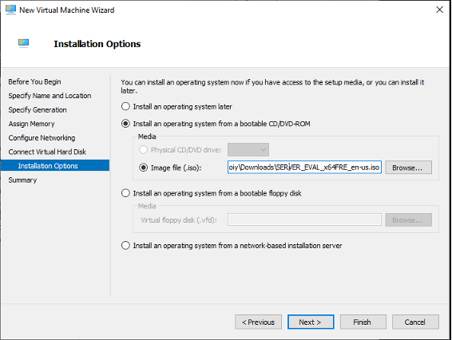

### 2.2 Expanding the Infrastructure (SV02 & Client Workstations)
After completing the DC01 setup, I began provisioning the rest of the enterprise environment.

* **Utility Server (SV02):** Created to handle file storage and application services.
  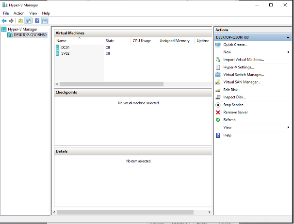

* **Workstation Deployment (CHOIYONTECH-PC01):**
  I started the rollout of the client machines following the strict naming convention.
  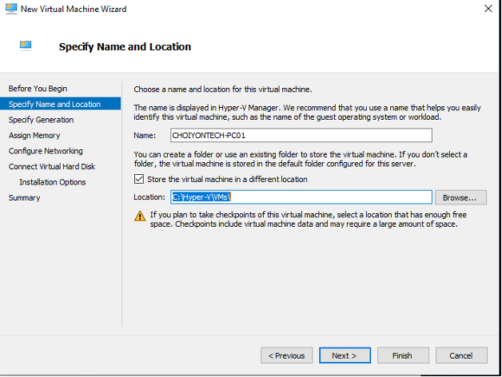

### 2.3 Hyper-V Environment Overview
Once the initial provisioning was complete, my Hyper-V Manager displayed the full roster of virtual assets ready for configuration.
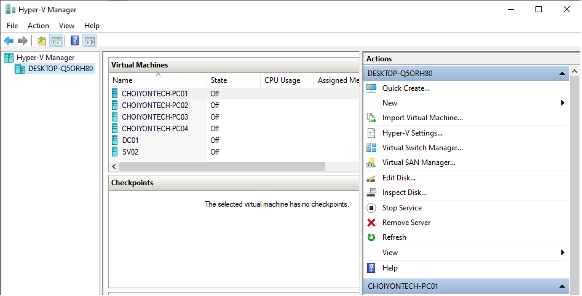

---

---

## Phase 3: OS Installation & Core Configuration

With the virtual hardware provisioned, I proceeded with installing the operating systems and establishing the network identity for the core servers.

### 3.1 Windows Server 2022 Installation (DC01)
I initiated the boot process using the Server 2022 ISO. The installation was performed using the **Desktop Experience** to allow for easier administrative management during the initial lab build.
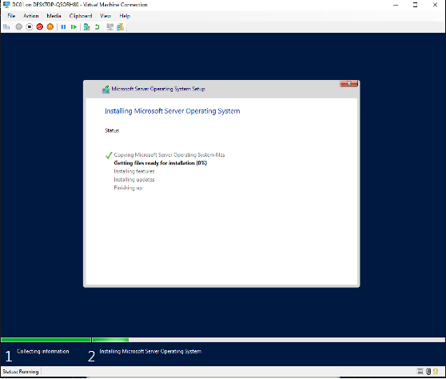

Once the installation finished, I established the local administrator credentials to secure the system.


### 3.2 Network Identity & Static IP Assignment
For a Domain Controller to function reliably, it requires a persistent network identity. I manually configured the IPv4 settings on `DC01` to use a static IP within my lab's subnet.
* **IP Address:** `192.168.10.5`
* **Subnet Mask:** `255.255.255.0`
* **Gateway:** `192.168.10.1`
* **DNS:** Pointed to Google's public DNS (`8.8.8.8`) for initial internet connectivity before the local DNS role is promoted.
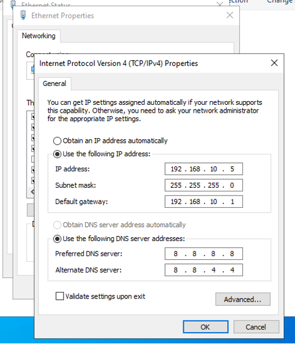

### 3.3 System Verification
I verified the system properties and naming for the client workstations to ensure the naming convention was applied correctly at the OS level.
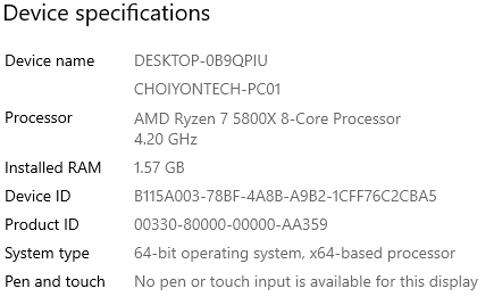

---

## Phase 4: Active Directory Domain Services (AD DS)

This phase transforms the standalone server into a central authority for the `CHOIYONTECH` environment.

### 4.1 Installing the AD DS Role
I utilized the **Add Roles and Features Wizard** in Server Manager to begin the deployment of Active Directory Domain Services.
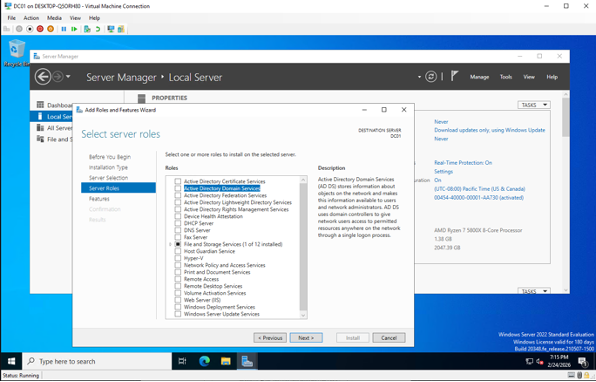

The installation includes the core directory services, Group Policy Management, and the necessary Remote Server Administration Tools (RSAT).
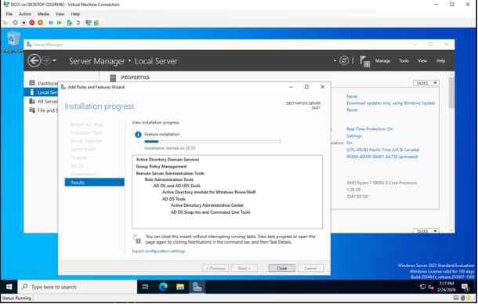

---
---

## Phase 4: Active Directory Domain Services (AD DS) - Continued

After the AD DS role was installed, I proceeded with the promotion of the server to a Domain Controller to establish the logical structure of the lab.

### 4.1 Forest Promotion & Domain Creation
I initiated the **Active Directory Domain Services Configuration Wizard** and selected "Add a new forest." I designated the root domain name as `choiyontech.local` to define the primary namespace for the environment.
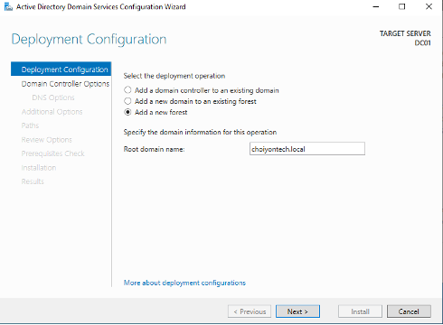

### 4.2 Domain Controller Options
I configured the functional levels and essential DC capabilities:
* **Functional Level:** Set to Windows Server 2016 for both Forest and Domain to maintain broad compatibility.
* **Capabilities:** Ensured **DNS Server** and **Global Catalog (GC)** were selected to handle name resolution and multi-domain queries.
* **DSRM:** Set a secure Directory Services Restore Mode password for emergency recovery.
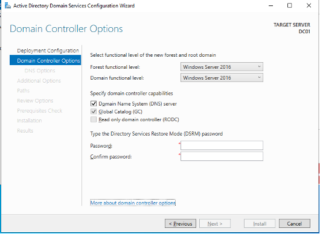

### 4.3 Post-Promotion Verification
Once the promotion and subsequent reboot were complete, the login screen updated to reflect the new domain identity. I verified that the system was successfully operating under the `CHOIYONTECH` NetBIOS name.
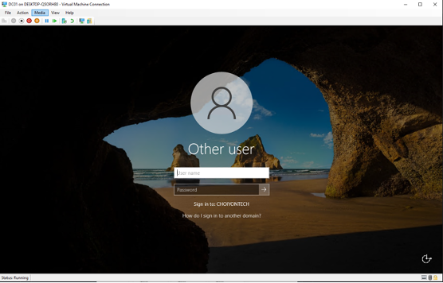

I then used **Server Manager** to confirm that the AD DS and DNS services were active and healthy.
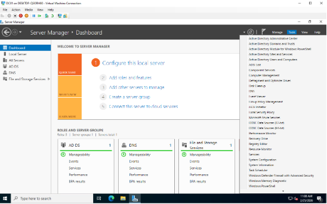

---

## Phase 5: Domain Infrastructure & Client Integration

With the Domain Controller operational, I moved toward organizing the directory and bringing endpoints into the fold.

### 5.1 Organizational Unit (OU) Architecture
To simulate a real corporate environment, I used the **Active Directory Administrative Center** to build a logical hierarchy. I created a top-level OU named `Bangladesh` to house the specific departments of the organization.
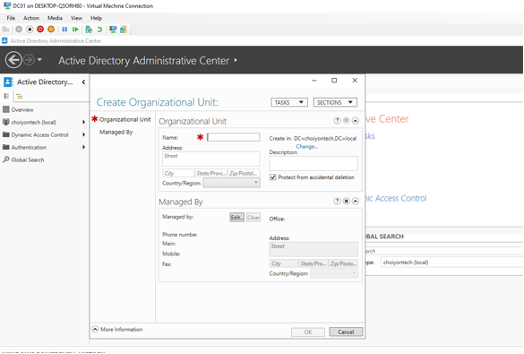

Within this structure, I created sub-OUs for specific business units including **IT, Finance, Sales, HR, Marketing, Development, and Administration**. This setup allows for granular Group Policy (GPO) application later in the project.
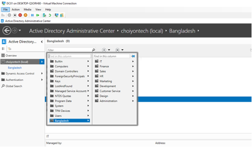

### 5.2 Network Configuration for Endpoints
Before joining the workstations to the domain, I manually configured the IPv4 settings for `CHOIYONTECH-PC01`.
* **Static IP:** `192.168.10.20`
* **DNS:** Pointed to `192.168.10.5` (DC01) to ensure the workstation can resolve the domain controller and the `choiyontech.local` namespace.
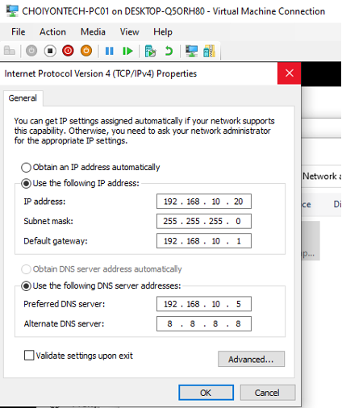

### 5.3 Joining the Domain
With the network settings verified, I navigated to the System Properties on the client machine and joined it to the `choiyontech.local` domain. I authenticated using the domain administrator credentials to authorize the bind.
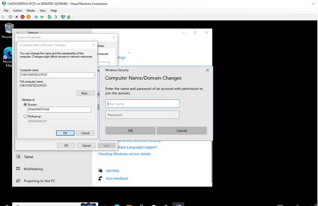

---
## Phase 6: User & Group Management

To transform the lab into a simulation of a live enterprise, I populated the directory with a diverse set of users assigned to specific departmental Organizational Units (OUs).

### 6.1 User Account Provisioning
I established a primary user list to simulate various roles across the organization. Each account was configured with standardized attributes including unique usernames, job titles, and departmental assignments to ensure proper resource access and policy application.

I utilized **Active Directory Users and Computers (ADUC)** to create a dedicated container named `CHOIYONTECH_Users` to manage the core staff accounts.
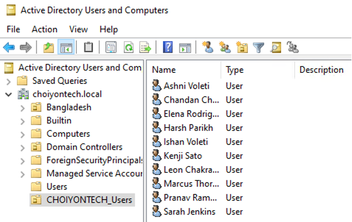

### 6.2 Directory Population & Verification
I verified the global user list within the **Active Directory Administrative Center (ADAC)**. This view confirms that accounts for users such as Amara Okafor, Simon De Backer, and Lakshmi Chakraborty are correctly initialized within the `choiyontech.local` domain.
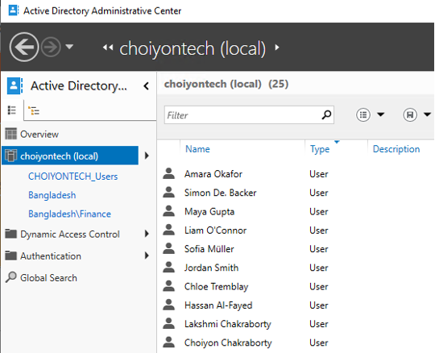

6.3 Configuring UPN Suffixes for Cloud Readiness
To prepare the local environment for future hybrid integration (such as Microsoft 365), I configured an alternative **User Principal Name (UPN) Suffix**. This ensures that local user accounts can use a publicly routable domain name for logins rather than the internal `.local` extension.

1. **Adding the Alternative UPN Suffix:**
   Using **Active Directory Domains and Trusts**, I accessed the properties of the forest to add `choiyontech.onmicrosoft.com` as an alternative UPN suffix.

2. **Assigning Suffixes to Users:**
   I then utilized the **Active Directory Administrative Center** to bulk-update user accounts. This allows users to authenticate using the new suffix, facilitating a seamless transition for future cloud-based services.
  
---

## Progress Tracker & Next Steps

* [x] Unlocking Hyper-V & Virtualization
* [x] NAT Virtual Switch & Networking Foundation
* [x] Initial VM Provisioning (DC01, SV02, PC01-04)
* [x] Windows Server 2022 OS Installation
* [x] AD DS Forest Promotion (choiyontech.local)
* [x] Departmental OU Structure Implementation
* [x] **Bulk User Account Provisioning & Management**
* [ ] DHCP Scope Implementation
* [ ] Group Policy (GPO) Security Hardening
* [ ] Network Monitoring Node (Debian) Setup
